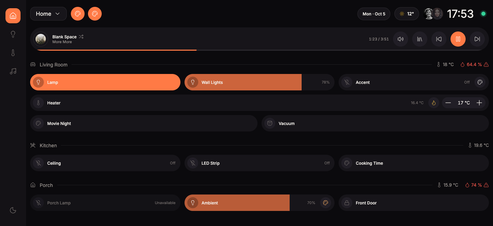
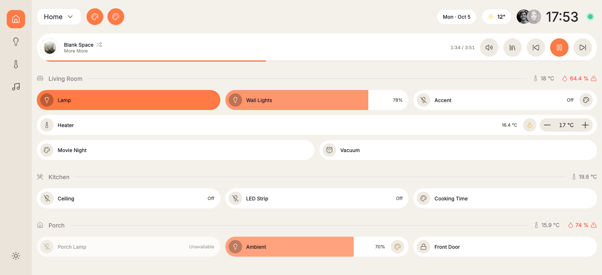
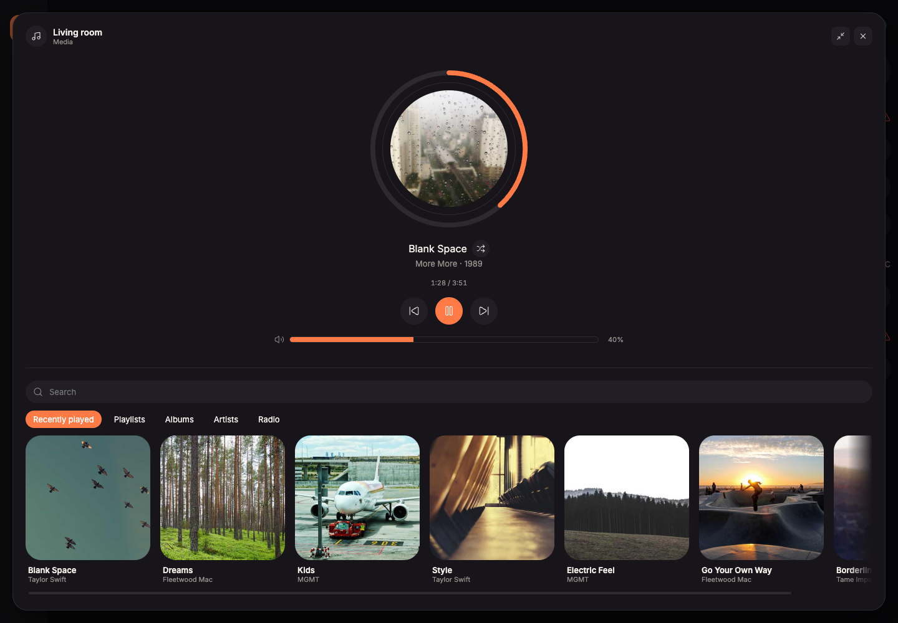
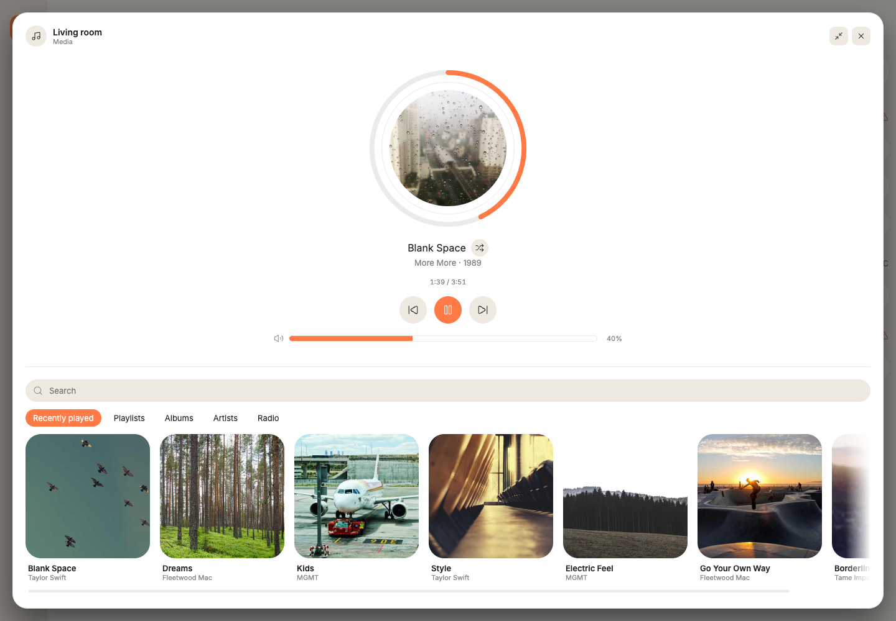

# hash

[](https://github.com/dstoyanoff/hash/actions/workflows/ci.yml)

**Smart-home dashboards you build like software.** A real design system, real React components and
a small server, in place of a drag-and-drop card editor. You write the dashboard for a wall tablet,
a phone or a small kitchen display as ordinary code, and hash keeps it live, themed and easy to
deploy.

<table>
  <tr>
    <td width="50%"></td>
    <td width="50%"></td>
  </tr>
  <tr>
    <td align="center"><sub>Dark</sub></td>
    <td align="center"><sub>Light, or follow the system</sub></td>
  </tr>
</table>

## What you get

- **Components that already know your devices.** Give a light tile an entity id and you get on/off,
  dimming, colour and colour temperature, a hold-to-open drawer with history and power use, and
  pending/error feedback. The same goes for climate, sensors, scenes, media players and more. See
  every one in every state in the **[component gallery](https://dstoyanoff.github.io/hash/)**.
- **A full media experience.** A compact player bar, an upright card, and a full-page player with
  your library: playlists, albums, artists and search, with artwork, shuffle and seeking.
- **Real history, not placeholders.** Sensor charts, energy use per day, week and month, and
  battery levels come from your backend's own records when it keeps them.
- **Light, dark or follow the system**, plus a compact density for small square displays. Change
  any colour, radius or spacing with one overrides object.
- **Your tokens stay on the server.** The browser talks to hash's server, which talks to your home.
  Nothing secret reaches a tablet.
- **Not tied to one backend.** Home Assistant and Music Assistant work today, side by side.
  See [Works with any backend](#works-with-any-backend).
- **Deploys anywhere**, and builds where you build it, never where it runs. See
  [Deploying](#deploying).
- **Built to be extended by an AI coding agent** as well as by hand. See
  [Build a dashboard](#build-a-dashboard).

<table>
  <tr>
    <td width="50%"></td>
    <td width="50%"></td>
  </tr>
  <tr>
    <td colspan="2" align="center"><sub>The full-page media player, with the library docked below it</sub></td>
  </tr>
</table>

## Try it in two minutes

```bash
git clone https://github.com/dstoyanoff/hash.git
cd hash
corepack enable        # gets you the right pnpm
pnpm install
pnpm dev
```

Open **http://localhost:3000/home**. It runs on mock data, so there is something to click without a
smart home connected. The other examples are at `/second-floor`, `/kitchen` and `/hello`.

For the component gallery on its own: `pnpm --filter @hash/ui docs`.

### Connect your home

Point it at a real Home Assistant and/or Music Assistant with environment variables. They are
independent: set either, both or neither, and anything unset keeps using mock data.

```bash
HA_URL=http://homeassistant.local:8123 HA_TOKEN=<a long-lived access token> \
MA_URL=http://mass.local:8095 MA_TOKEN=<a token from Settings → Profile> \
pnpm dev
```

In Home Assistant, create the token under your profile → **Long-lived access tokens**. For a token
that belongs to the dashboard and not to you, create a separate non-admin user for it first.
Music Assistant is talked to directly over its own API, not through Home Assistant.

## Build a dashboard

A dashboard is a folder of React under your project's `dashboards/`, and a route in
`app/routes.ts` makes it reachable at `/<id>`. You compose the page from `@hash/ui`:

```tsx
import { ClimateTile, Grid, LightTile, RoomHeader, SensorReadout } from '@hash/ui';

export const meta = () => [{ title: 'Living room' }];

export default function LivingRoom() {
  return (
    <>
      <RoomHeader
        title="Living room"
        icon="lu:sofa"
        readouts={<SensorReadout entity="ha:sensor.living_room_temperature" />}
      />
      <Grid columns={2}>
        <LightTile entity="ha:light.living_room_lamp" name="Lamp" />
        <ClimateTile entity="ha:climate.living_room" name="Heater" />
      </Grid>
    </>
  );
}
```

```ts
// app/routes.ts: every URL in one place
route('living-room', '../dashboards/living-room/page.tsx'),
```

Devices are addressed as `<integration>:<id>`, such as `ha:light.kitchen` or `ma:kitchen`. A
dashboard owns its whole layout: add the top bar, a left navigation rail or a bottom dock, or leave
them out for a bare kiosk panel. Icons are plain strings (`'lu:lightbulb'`, `'tb:vacuum-cleaner'`).

### Or ask your agent

If you use Claude Code or another coding agent, the repo ships the skills it needs. Once it is
running, ask for what you want:

> Create a dashboard for my kitchen. It's a tablet on the wall. Devices: the ceiling light, a LED
> strip, the thermostat, and a "cooking time" scene.

The agent scaffolds the dashboard, looks up your real entity ids (or uses placeholders until you
connect a backend), composes the page from the design system, wires up the route and checks that
it renders. The skills live in `.claude/skills/`, and they are also good reading for doing the
same by hand.

## Works with any backend

The components never talk to a specific system. Each backend has an **integration** that turns it
into a small, generic model (a light, a climate device, a media player, a sensor, ...) and turns
the UI's commands back into that backend's own. Your project lists the ones it uses:

```ts
// hash.config.ts
import { HomeAssistantIntegration } from '@hash/integration.home-assistant';
import { MusicAssistantIntegration } from '@hash/integration.music-assistant';
import { defineConfig } from '@hash/runtime';

export default defineConfig({
  integrations: [
    new HomeAssistantIntegration({ url: process.env.HA_URL!, token: process.env.HA_TOKEN! }),
    new MusicAssistantIntegration({ url: process.env.MA_URL!, token: process.env.MA_TOKEN! }),
  ],
});
```

This is why one dashboard can show a Home Assistant light next to a Music Assistant player, and
why adding a new backend means writing one integration package and touching nothing else. Anything
you build for the UI keeps working, whichever system sits behind it. The contract and how it fits
together are in **[ARCHITECTURE.md](ARCHITECTURE.md)**.

## Deploying

Build once on your own machine. Nothing is compiled, and no source is copied, where it runs.

```bash
pnpm package helm --platform linux/amd64     # or: compose, plain, image
```

`hash-dash package` builds your dashboards, bundles the server with your config and integrations
into one file, and writes what you need into `./release`:

| Target    | What you get                                               | Needs                  |
| --------- | ---------------------------------------------------------- | ---------------------- |
| `plain`   | `server.mjs` and `client/`: run it with `node server.mjs`  | Node 24+ where it runs |
| `compose` | a Docker Compose file and the container image              | Docker where it runs   |
| `helm`    | a Helm chart for k3s/Kubernetes and the container image    | k3s/Kubernetes + helm  |
| `image`   | only the container image, for manifests you write yourself | a container runtime    |

Set a default in `hash.config.ts` so `pnpm package` takes no flags:

```ts
export default defineConfig({
  integrations: [...],
  package: { targets: ['helm'], platform: 'linux/amd64' },
});
```

**Secrets are never in the image or the release files.** The server reads `HA_URL`, `HA_TOKEN` and
the rest from its environment when it runs: an `.env` file for compose, a Kubernetes Secret for
helm. No registry is involved: copy `release/`, load `image.tar` and start it. Point a tablet's
browser or a kiosk app at `http://<the server>:3000/<id>`.

How the release is built, and how to load the image on k3s, is in
[ARCHITECTURE.md](ARCHITECTURE.md#packaging-and-deployment).

## Layout

```
packages/        the framework: core, ui, runtime, and one package per integration
example/         a complete project you can run, and the template for your own
templates/       scaffolds for new dashboards
docs/            screenshots
```

Everything under `example/` is an ordinary project that uses the framework, the same as yours
would. Where each piece lives, and why, is in [ARCHITECTURE.md](ARCHITECTURE.md).

## Development

```bash
pnpm lint             # oxlint
pnpm format:check     # oxfmt (pnpm format to fix)
pnpm typecheck
pnpm test             # vitest, every package
pnpm generate:catalog # regenerate the component catalog after changing a component
```

Node is pinned in `package.json` and managed by pnpm, so no nvm is needed; `corepack enable` gets
the matching pnpm. More detail on the rules is in [`AGENTS.md`](AGENTS.md), which Claude Code also
reads as `CLAUDE.md`.

## Status

Under active development; milestones are tracked as
[GitHub issues](https://github.com/dstoyanoff/hash/issues). The packages are not on npm yet, so
today you use hash by cloning the repository and adding your dashboards to a project like
`example/`.

## License

[GPL-3.0](LICENSE).
